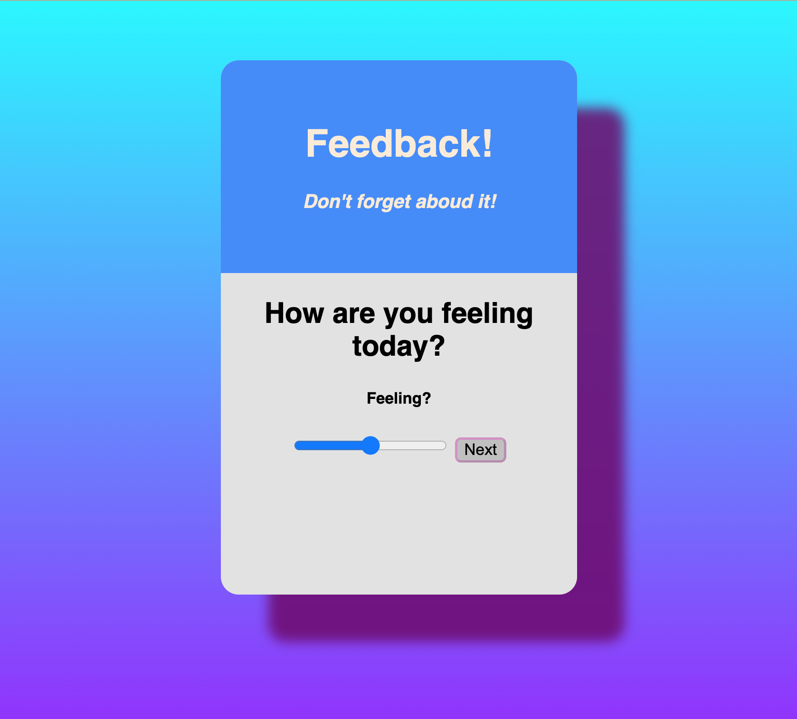

# Project Name
Redux feedback loop

## Description
With this project I needed to create a feedback submission form which collected information from four seperate components and display that information in another for review. Apon submission, the data would be sent to the server and stored in the database and the user would be brought to a submission success page. They can then click the button to take a new survey, which needs to reset all the data and go back to the first step. The app also needs to have input validation and scores should be between 1-5. 

For me the trickiest part of this assignment was setting up the server as it had been a while since I needed to do so. For that I refered to my notes. Everything else was pretty straightforward. I enjoyed setting up the routes, reducers, and components. Some people might find it a bit tedious but I found it to be relaxing and good practice! I tried to create an admin page and even set up a get request to the server which worked as expected, but trying to map through the results proved unsuccessful. 

